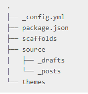
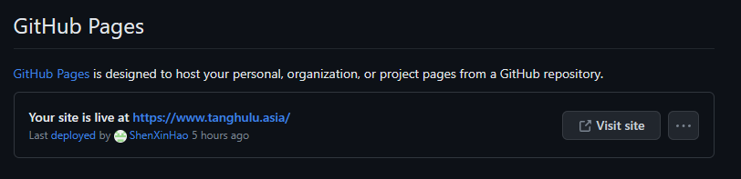

# Hexo的安装

Hexo的安装优先看Hexo官方网站的文档，内容十分详细。附上官方文档的[链接](https://hexo.io/zh-cn/docs/index.html)。

对于Git安装有疑问的，这里推荐对小白十分友好Git教程——廖雪峰的[Git](https://www.liaoxuefeng.com/wiki/896043488029600)教程。

---

## 开发环境

开发环境比较简单，只有Git和NodeJs，安装好之后验证通过就可以进行后续的操作。

## Hexo部署

在你想安装的位置创建好文件夹，右键使用Git Bash Here(如果你是win11,右键菜单如果没有该选项，请点击显示更多选项)


所有必备的应用程序安装完成后，即可使用 npm 安装 Hexo，下面的命令是全局安装，如果你对npm比较熟悉，可以不用-g，随后手动添加环境变量。不过推荐使用该方法，可以省去很多麻烦。

```
$ npm install -g hexo-cli
```

确保你的网络通畅，等待片刻之后就能在你的文件夹中看到有关hexo的node_modules文件夹。

接下来执行下述命令之后，就可以在git bash页面里面看到


之后复制链接到浏览器即可看到默认的hexo页面。

```
 hexo init blog
 cd blog
 npm install
 hexo server
```

点击生成blog文件夹后，内目录文件如下：



其中_config.yml是hexo配置文件，里面可以对网页部分内容进行修改，比如作者名字，以及设置主题；themes文件夹下放安装的主题文件，source/_posts文件夹内放的是Markdown源文件。package.json内包含了项目信息，以及依赖。

## githubPage部署

这一步可以跟着[GithubPages](https://pages.github.com/)官网部署教程。

新建好仓库之后，拉取到本地，将hexo成功部署后的所有文件放入本地仓库地址内。随后在hexo内部署githubpages。

关于配置githubPages，建议使用一键部署：

1. 在hexo文件内使用npm install 安装 [hexo-deployer-git](https://github.com/hexojs/hexo-deployer-git)。
2. 在 `_config.yml` 中添加以下配置（如果配置已经存在，请将其替换为如下）:

```
deploy:
  type: git
  repo: https://github.com/<username>/<project>
  # example, https://github.com/hexojs/hexojs.github.io
  branch: gh-pages
```

做好上述工作之后，首先ctrl+c将本地的网站关闭，随后执行

```hexo clean，hexo g
hexo clean
hexo g
hexo d
```

随后前往github仓库，setting下的pages选项，找到如下进行设置，选择从分支部署，在分支选项中选取gh-pages:


点击save之后就可以在GitHub Pages标题下直接访问你的博客网站。



